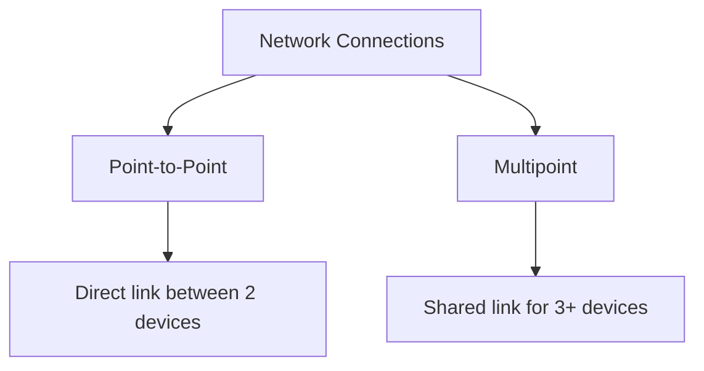

# 🌐 Networking & Internet

## 1️⃣ Concept of Computer Network

**Definition:**

A computer network is a group of interconnected computing devices that exchange data and share resources with each other.

**Key Points:**
- Enables file sharing, internet access, and communication.  
- Can be **wired or wireless**.  
- Managed by **network devices** like routers, switches, and hubs.

---

## 2️⃣ Types of Network Connections

**Definition:** The type of connection describes **how devices are linked together** in a network.  

### **1. Point-to-Point (P2P) Connection**
- **Definition:** A direct link between **two devices only**.  
- **Characteristics:**  
  - One sender, one receiver  
  - Simple and private connection  
- **Examples:**  
  - Telephone line between two offices  
  - Direct cable between two computers  

### **2. Multipoint (Multi-access) Connection**
- **Definition:** A single communication channel shared by **three or more devices**.  
- **Characteristics:**  
  - Multiple devices can communicate over the same medium  
  - Can be **synchronous** (all devices take turns) or **asynchronous**  
- **Examples:**  
  - LAN using a bus topology  
  - Wi-Fi network shared by multiple devices  
  - Cable TV network  

**Key Point:**  
- **Point-to-Point:** Dedicated, private link  
- **Multipoint:** Shared, multiple users/devices on one channel  

---

## 3️⃣ Network Topologies

**Definition:**  
The **physical or logical layout** formed by **how devices are connected** in a network is called a **network topology**.

graph TD
A[Network Topologies] --> B[Bus]
A --> C[Star]
A --> D[Ring]
A --> E[Mesh]
A --> F[Tree]
A --> G[Hybrid]

**Key Point:**  
- The **type of connection between devices** (Point-to-Point or Multipoint) **creates the topology**.  
- Topology affects **network performance, reliability, and cost**.

| **Topology** | **Description** | **Advantages** | **Disadvantages** |
|--------------|----------------|----------------|-----------------|
| **Bus** | Devices connected to a single backbone cable | Easy to set up, low cost | Difficult troubleshooting, limited cable length |
| **Star** | Devices connected to a central hub/switch | Easy to manage, robust | Hub failure affects network |
| **Ring** | Devices connected in a circular loop | Equal access, orderly data flow | One failure can disrupt network |
| **Mesh** | Each device connected to every other device | Highly reliable, no single point of failure | Expensive, complex |
| **Tree** | Combination of Star and Bus | Scalable, hierarchical | Backbone failure affects entire network |
| **Hybrid** | Combination of multiple topologies | Flexible, scalable | Complex design |

---

## 4️⃣ Data Communication

**Definition:**  
**Data communication** is the **exchange of data between devices** through a transmission medium.

**Elements of Data Communication:**

graph TD
A[Data Communication] --> B[Sender]
A --> C[Receiver]
A --> D[Message]
A --> E[Medium/Channel]
A --> F[Protocol]

1. **Sender** – Device that sends the data  
2. **Receiver** – Device that receives the data  
3. **Message** – The actual data to be transmitted  
4. **Medium / Channel** – Path through which data travels  
5. **Protocol** – Set of rules that governs data transmission  

---

## 5️⃣ Types of Transmission Media

graph TD
A[Transmission Media] --> B[Guided (Wired)]
A --> C[Unguided (Wireless)]
B --> D[Twisted Pair]
B --> E[Coaxial Cable]
B --> F[Fiber Optic]
C --> G[Radio Waves]
C --> H[Microwave]
C --> I[Infrared]
C --> J[Satellite]

### **1. Guided (Wired) Media**
- **Twisted Pair Cable:** Used in LANs, affordable, moderate speed  
- **Coaxial Cable:** High-speed, used in cable networks  
- **Fiber Optic Cable:** Very high-speed, long-distance, uses light pulses  

### **2. Unguided (Wireless) Media**
- **Radio Waves:** Wi-Fi, Bluetooth, mobile networks  
- **Microwave:** Long-distance point-to-point communication  
- **Infrared:** Short-range communication (remote controls)  
- **Satellite Communication:** Global communication via satellites  

---

## 6️⃣ Summary

| **Concept** | **Key Points / Examples** |
|-------------|---------------------------|
| Computer Network | Connects devices for sharing resources — *LAN, WAN, MAN* |
| Network Connection | How devices are linked — *Point-to-Point, Multipoint* |
| Network Topology | Layout of connections — created by the type of connection — *Star, Bus, Ring, Mesh* |
| Data Communication | Exchange of data — Sender, Receiver, Message, Medium, Protocol |
| Transmission Media | Guided & Unguided — *Twisted Pair, Fiber Optic, Radio Waves, Satellite* |
